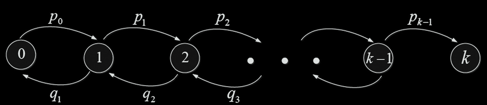

# (Burst/GI/n, m) simulator

This repository contains an implementation of a simulation algorithm for a multi-channel queueing system with "burst" traffic, denoted as **(Burst|GI|n, m)**.

### System Description
The model investigates a queueing system with an arbitrary queue length $n$ and $m$ service devices. The core methodology relies on the theory of **Marked Markov Processes (MMP)**.

**Key Features:**
* **"Burst" Input Traffic:** The arrival process combines regular intervals with random "bursts". At discrete time intervals $S(t)$, with probability $q = 1-p$, a "burst" occurs, resulting in the simultaneous arrival of a batch of tasks. The batch size follows an exponential distribution with parameter $\lambda$.
* **Service Discipline:** Recurrent service with arbitrary service times ($GI$ - General Independent). Service times are independent, identically distributed (i.i.d.) random variables.
* **System State:** The state is defined by the pair $(J(t), \mathbf{X}(t))$, where $J(t)$ is the number of requests in the system, and $\mathbf{X}(t)$ represents a set of "labels" (residual times for arrival and service completion).

### Methodology
The simulation tracks the system's dynamics by recalculating the "labels" at each step. This involves using order statistics (variational series) and applying **Shift** and **Add** operators to updated residual times.

### Project Goals
1. **Simulation Algorithm:** Implementation of the simulation logic for the (Burst|GI|n, m) system.
2. **Regeneration Analysis:** Investigation of system regeneration periods and construction of the empirical Cumulative Distribution Function (CDF) $\hat{F}_\Pi = P(\Pi \le t)$.
3. **Sensitivity Analysis:** Evaluation of how variations in input parameters (burst probability, service rates, etc.) affect the system's performance metrics.

